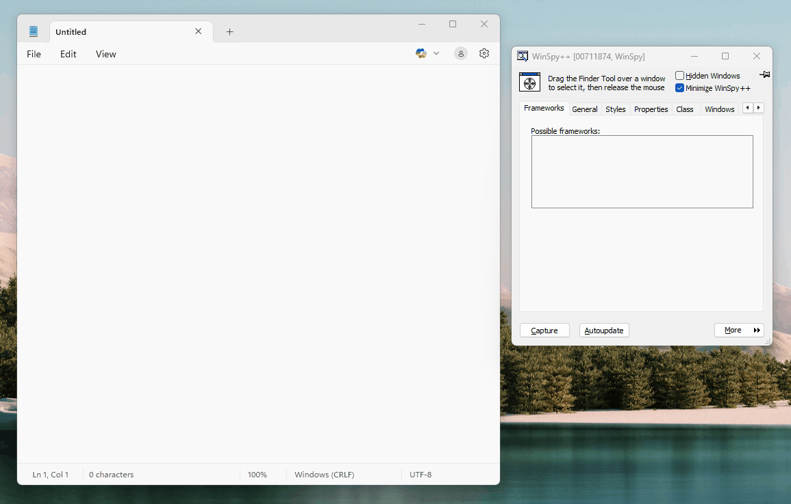

About the fork: FxSpy
--------------

The fork builds on WinSpy++ to add support for detecting which frameworks (UI frameworks and others) might be involved in rendering the window the user is investigating.

WinSpy++
--------

WinSpy++ is a programmer's utility for inspecting and modifying window properties of any Windows program.

Building WinSpy++
-----------------

WinSpy++ requires Visual Studio 2015 (with "MFC" and "Windows XP support for C++" features installed), and supports Win32 and Win64 builds. Use the IDE to build WinSpy++, or the build/build.bat command-line script (requires Ruby) to build and package a zip file for distribution.